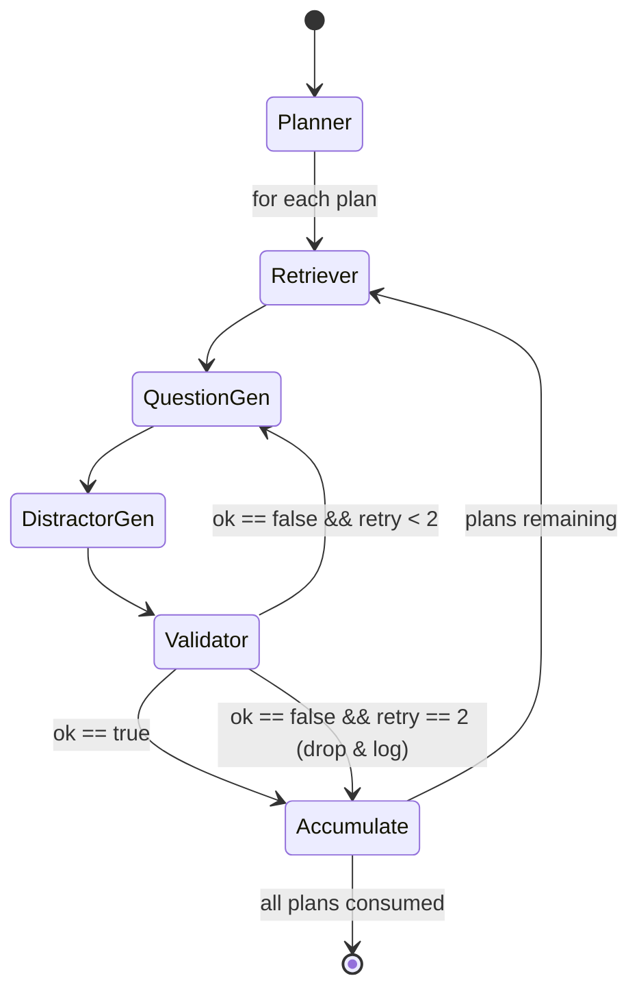
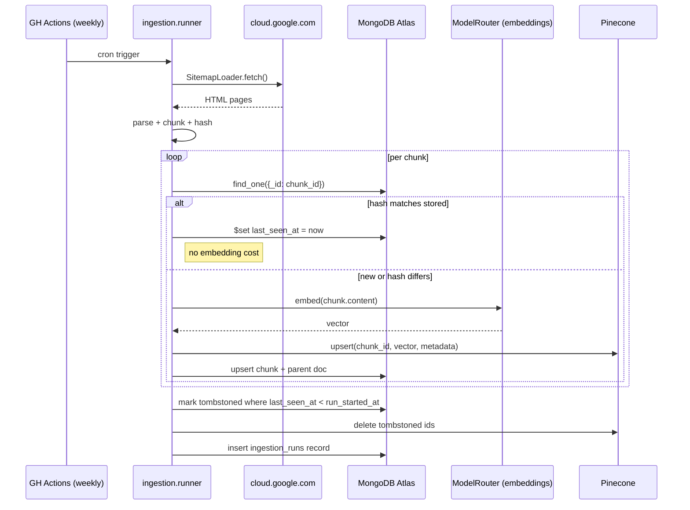

```
Certif-Exam-Generator/
├── architecture-app.md                 ← you are here
├── README.md
├── pyproject.toml
├── .env.example
├── .github/
│   ├── workflows/
│   │   ├── ci.yml                      # lint + pytest on PR
│   │   └── weekly-ingest.yml           # §9
│   └── dependabot.yml
├── src/certgen/
│   ├── __init__.py
│   ├── core/
│   │   ├── settings.py
│   │   ├── model_router.py
│   │   └── cloud_provider.py
│   ├── ingestion/
│   │   ├── sitemap_loader.py
│   │   ├── parser.py
│   │   ├── chunker.py
│   │   ├── hasher.py
│   │   ├── delta.py
│   │   ├── embedder.py
│   │   ├── upserter.py
│   │   └── runner.py
│   ├── rag/
│   │   └── hybrid_retriever.py
│   ├── agent/
│   │   ├── state.py
│   │   ├── graph.py
│   │   └── nodes/
│   │       ├── planner.py
│   │       ├── retriever.py
│   │       ├── question_gen.py
│   │       ├── distractor_gen.py
│   │       └── validator.py
│   ├── api/
│   │   ├── main.py
│   │   ├── schemas.py
│   │   └── routes/
│   │       ├── exams.py
│   │       └── ops.py
│   └── observability/
│       ├── langsmith.py
│       └── logging.py
├── tests/
│   ├── unit/
│   ├── integration/                    # hits a testcontainers Mongo + mocked Pinecone
│   └── fixtures/
├── configs/
│   └── certs/gcp-pca.yaml
├── docker-compose.yml                  # local Mongo for offline dev
└── Dockerfile                          # API image
```

---

### Graph shape




> The `<lastmod>` tag in enterprise sitemaps is unreliable (entire sitemaps often re-timestamp on cosmetic CMS changes). Content hashing is the source of truth.

