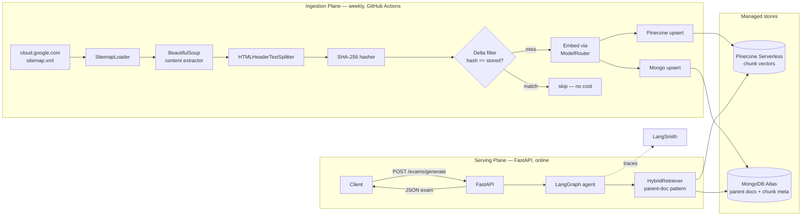
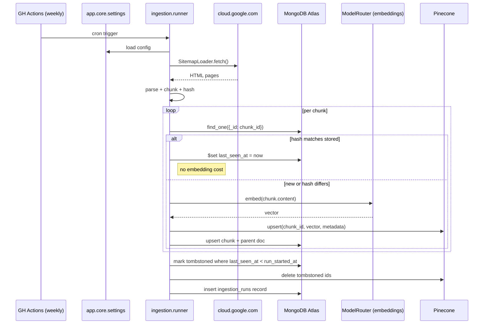
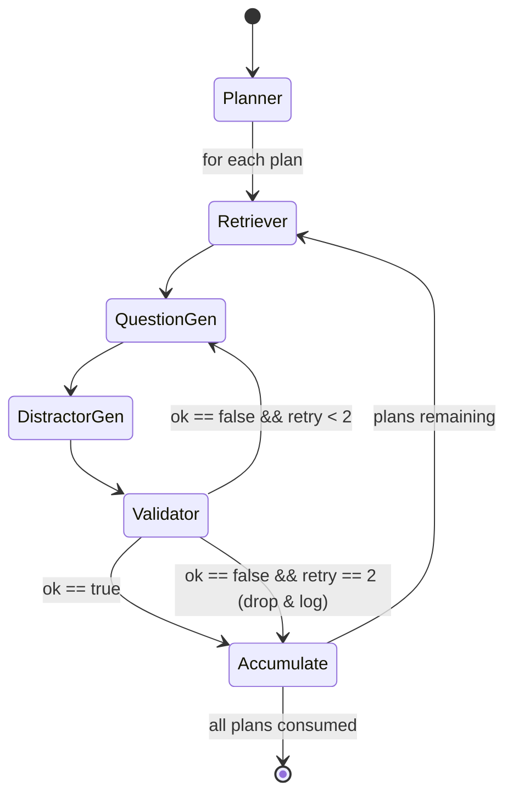

# Certif-Exam-Generator — Architecture

> A LangGraph-driven generator of cloud certification practice exams (GCP PCA in v1), grounded in the provider's own documentation via a cost-optimised Hybrid RAG.

---

## Table of Contents

1. [Executive Summary](#1-executive-summary)
2. [Problem & Goals](#2-problem--goals)
3. [High-Level Architecture](#3-high-level-architecture)
4. [Component Inventory](#4-component-inventory)
5. [Data Model](#5-data-model)
6. [Delta-Update Workflow (Hash-Based Sync)](#6-delta-update-workflow-hash-based-sync)
7. [LangGraph Agent Design](#7-langgraph-agent-design)
8. [API Contract](#8-api-contract)
9. [Ingestion Scheduling](#9-ingestion-scheduling)
10. [Cost Model](#10-cost-model)
11. [Security & Secrets](#11-security--secrets)
12. [Extensibility Path](#12-extensibility-path)
13. [Non-Goals (v1)](#13-non-goals-v1)
14. [Repository Layout](#14-repository-layout)
15. [Trade-offs & Rejected Alternatives](#15-trade-offs--rejected-alternatives)

---

## 1. Executive Summary

**Certif-Exam-Generator** produces on-demand practice exams for cloud certifications, starting with the **Google Cloud Professional Cloud Architect (PCA)** exam. The system is split into two planes:

- An **ingestion plane** that scrapes `cloud.google.com` weekly via `SitemapLoader`, chunks pages by HTML headers, content-hashes each chunk, and only re-embeds chunks whose hash has changed. Parent-page text goes to **MongoDB Atlas**; chunk vectors go to **Pinecone Serverless**.
- A **serving plane** — a FastAPI service — that exposes `POST /exams/generate` and delegates question authoring to a **LangGraph** agent with five nodes (Planner → Retriever → Question-Gen → Distractor-Gen → Validator) and a self-correction loop on the Validator edge.

The design is optimised for three senior-engineer concerns: **freshness** (weekly delta sync keeps material current), **cost** (hash-skipping avoids 95%+ of redundant embedding calls after week 1), and **extensibility** (a `CloudProvider` abstraction lets AWS and Azure plug in without touching the agent or API).

---

## 2. Problem & Goals

### Problem

Commercial cloud-certification prep material goes stale within months of the exam's annual blueprint refresh, and most open-source question banks are unreviewed or scraped verbatim from copyrighted sources. A candidate preparing today has no reliable way to generate fresh, doc-grounded practice questions with citations back to the canonical source.

### Goals

| Goal | Measurable outcome |
|---|---|
| Grounding | Every generated question carries a list of source URLs retrieved from the official docs. |
| Freshness | Content lag ≤ 7 days from `cloud.google.com` publish time. |
| Cost control | Steady-state ingestion cost < $1 / month for PCA-scope corpus. |
| Correctness | Validator node rejects questions whose correct answer isn't supported by retrieved context. |
| Extensibility | Adding AWS or Azure = one new adapter, zero changes to agent/API. |

### Non-goals (v1)

See [§13](#13-non-goals-v1).

---

## 3. High-Level Architecture



**Two-plane separation** is deliberate: the ingestion plane is a batch pipeline that must never block request serving, and the serving plane is stateless (every piece of persistent state lives in Mongo or Pinecone), so the FastAPI container can scale horizontally without coordination.

---

## 4. Component Inventory

### `src/certgen/ingestion/`
Responsible for turning a cloud provider's public docs into hashed, chunked, embedded records in the stores.

| Module | Responsibility | Key libs | Non-goals |
|---|---|---|---|
| `sitemap_loader.py` | Wrap `SitemapLoader` with per-provider URL filters. | `langchain_community.document_loaders.SitemapLoader` | Does not fetch non-sitemap pages. |
| `parser.py` | Strip navigation/ads, keep main content, extract canonical URL + title. | `beautifulsoup4` | No PDF/video parsing. |
| `chunker.py` | Split by semantic headers, preserve `header_path` metadata. | `langchain.text_splitter.HTMLHeaderTextSplitter` | No fixed-token fallback in v1. |
| `hasher.py` | SHA-256 over `(normalized_text + header_path)`. | `hashlib` | Hash is content-only — URL moves don't invalidate. |
| `delta.py` | Compare incoming hash to Mongo's stored hash; emit `{new, changed, unchanged, deleted}` sets. | `services.mongodb` | — |
| `embedder.py` | Batch-embed via `ModelRouter`; tags vectors with `embedding_model_version`. | `ModelRouter` (§4 core) | Does not retry individual failures past 3 attempts — surfaces to the run log. |
| `upserter.py` | Transactional-ish upsert: Pinecone first (idempotent), then Mongo, then commit run record. | `services.pinecone`, `services.mongodb` | No distributed transaction — see [§6](#6-delta-update-workflow-hash-based-sync) on crash-safety. |
| `runner.py` | CLI entrypoint called by the GitHub Actions job. | `click` / `typer` | — |

### `src/certgen/rag/`
Responsible for turning a natural-language query into a list of grounded parent documents.

| Module | Responsibility |
|---|---|
| `hybrid_retriever.py` | Parent-Document Retrieval: query Pinecone for top-k chunk IDs, then fetch each chunk's parent `document` from Mongo. Returns parent docs (deduplicated) plus the matching chunk excerpts as citations. Delegates all store I/O to `services.pinecone` and `services.mongodb`. |
| `reranker.py` *(optional, flagged off in v1)* | Cross-encoder rerank slot; no-op by default. |

### `src/certgen/services/`
Thin client wrappers that own connection lifecycle and raw driver calls for both stores. All other modules import from here — no direct `pinecone` or `pymongo` driver usage outside this package.

| Module | Responsibility | Key libs |
|---|---|---|
| `pinecone.py` | Client init (index name from settings), `upsert(vectors)`, `delete(ids)`, `query(vector, top_k, namespace, filter)`. | `pinecone` |
| `mongodb.py` | Client init (URI from settings), collection accessors: `upsert_chunk()`, `upsert_document()`, `find_chunk_by_id()`, `tombstone_chunks()`, `insert_ingestion_run()`. | `pymongo` |

### `src/certgen/agent/`
The LangGraph graph. See [§7](#7-langgraph-agent-design) for shape.

| Module | Responsibility |
|---|---|
| `state.py` | Typed `ExamGenState` (TypedDict / Pydantic) — the graph's shared state. |
| `nodes/planner.py` | Takes `ExamRequest` (cert, num_questions, domains, difficulty), emits a list of `QuestionPlan` items (topic + blueprint weight). |
| `nodes/retriever.py` | Wraps `HybridRetriever`; writes `RetrievedContext` into state. |
| `nodes/question_gen.py` | LLM call: turns one `QuestionPlan` + context into a `DraftQuestion`. |
| `nodes/distractor_gen.py` | LLM call: generates 3 plausible-but-wrong options tied to the same context. |
| `nodes/validator.py` | LLM-as-judge: verifies the stated correct answer is supported by the retrieved context; rejects otherwise. |
| `graph.py` | Wires nodes + conditional edges + checkpointer. |

### `src/certgen/api/`
Thin FastAPI layer — no business logic, just transport.

| Module | Responsibility |
|---|---|
| `main.py` | FastAPI app, CORS, rate-limit middleware. |
| `routes/exams.py` | `POST /exams/generate`, `GET /exams/{id}` (cached run). |
| `routes/ops.py` | `GET /health`, `GET /ingestion/status` (latest run summary from Mongo). |
| `schemas.py` | Pydantic request/response models (see [§8](#8-api-contract)). |

### `src/certgen/core/`
Cross-cutting abstractions.

| Module | Responsibility |
|---|---|
| `model_router.py` | Provider-agnostic factory: given a config key (`llm.generation`, `llm.embedding`), returns a LangChain `BaseChatModel` or `Embeddings` instance. Supported: OpenAI, Anthropic (+ Voyage embeddings), Google Gemini (+ Vertex embeddings). |
| `cloud_provider.py` | `CloudProvider` protocol — `sitemap_urls()`, `cert_blueprints()`, `url_filter()`. GCP adapter ships in v1. |
| `settings.py` | `pydantic-settings` — all env vars in one typed object. |

### `src/certgen/observability/`

| Module | Responsibility |
|---|---|
| `langsmith.py` | Sets `LANGCHAIN_TRACING_V2`, project name per environment. |
| `logging.py` | `structlog` JSON logs, correlation-id middleware for FastAPI. |

---

## 5. Data Model

### MongoDB Atlas (`certgen` database)

#### `documents` collection — parent pages
```jsonc
{
  "_id": "sha256(url)",
  "cloud": "gcp",
  "url": "https://cloud.google.com/architecture/framework",
  "title": "Google Cloud Architecture Framework",
  "canonical_url": "...",
  "markdown": "...full-page markdown...",
  "cert_tags": ["gcp-pca"],
  "fetched_at": "2026-04-19T00:00:00Z",
  "last_modified_header": "2026-04-12T00:00:00Z"
}
```

#### `chunks` collection — chunked children (one-to-many with `documents`)
```jsonc
{
  "_id": "sha256(url + '::' + header_path)",   // stable chunk_id, survives content edits
  "parent_doc_id": "<documents._id>",
  "cloud": "gcp",
  "url": "...",
  "header_path": ["Design", "Reliability", "SLOs"],
  "content": "...chunk text...",
  "content_hash": "sha256(normalize(content))", // the delta-sync key
  "embedding_model_version": "openai:text-embedding-3-small:v1",
  "cert_tags": ["gcp-pca"],
  "last_seen_at": "2026-04-19T00:00:00Z",      // touched every run the chunk is present
  "tombstoned_at": null                         // set when URL disappears from sitemap
}
```

#### `ingestion_runs` collection — audit log
```jsonc
{
  "_id": "<uuid>",
  "cloud": "gcp",
  "started_at": "...",
  "finished_at": "...",
  "stats": {
    "pages_seen": 842,
    "chunks_seen": 7_511,
    "chunks_new": 14,
    "chunks_changed": 63,
    "chunks_unchanged": 7_434,
    "chunks_tombstoned": 2,
    "embeddings_called": 77,
    "errors": 0
  },
  "embedding_model_version": "openai:text-embedding-3-small:v1",
  "git_sha": "..."
}
```

### Pinecone Serverless

- **One index per `embedding_model_version`** — e.g. `certgen-openai-emb3-small-v1`. Version bumps = new index, zero-downtime cutover via settings, old index dropped after verification.
- **Namespace per cloud provider**: `gcp`, `aws`, `azure`.
- **Vector ID = `chunk_id`** (same hash as Mongo `_id`), so a single lookup joins the two stores.
- **Metadata** (kept small, Pinecone charges for metadata storage): `{cloud, cert_tags, header_path_top}`.

### The Parent-Document Retrieval pattern

> Embed the *small* chunk for precise semantic match; serve the *large* parent document for LLM context.

1. Query Pinecone with the user/agent question → top-k `chunk_id`s.
2. Pull those chunks from Mongo to get `parent_doc_id`s (and the chunk text for citation).
3. Pull the de-duplicated parent documents from Mongo.
4. Feed (parent docs, chunk excerpts) to the LLM — the model sees enough surrounding context to reason, not just a 512-token snippet.

This is why the two stores are complementary rather than redundant.

---

## 6. Delta-Update Workflow (Hash-Based Sync)

> The `<lastmod>` tag in enterprise sitemaps is unreliable (entire sitemaps often re-timestamp on cosmetic CMS changes). Content hashing is the source of truth.



### Key properties

- **Skip-on-match**: the only cost for unchanged chunks is one cheap Mongo read. After week 1, expect 95%+ skip rate on stable docs.
- **Tombstoning**: any chunk whose `last_seen_at` is older than the current run's `started_at` is soft-deleted (`tombstoned_at` set) and removed from Pinecone. Soft-delete keeps the audit trail.
- **Crash safety**: Pinecone upsert is idempotent (same vector ID overwrites), and the chunk's `ingestion_runs` stats only commit at the end. A mid-run crash leaves the system in a valid state — the next run will simply re-observe and converge.
- **Embedding-model-version bump**: when `embedding_model_version` changes (e.g. upgrading from `text-embedding-3-small` to `-large`), the delta filter sees a model-version mismatch and forces re-embed of every chunk into the new Pinecone index. Old index is kept until cutover is verified.

---

## 7. LangGraph Agent Design

### Why LangGraph (not LCEL)

The generator needs **stateful retries on validation failure** and **per-question branching**. LCEL's pipe-composition does not cleanly express the self-correction loop; LangGraph's explicit state + conditional edges do.

### State schema

```python
class ExamGenState(TypedDict):
    # Inputs (set by API layer)
    request: ExamRequest                    # cert code, num_questions, domains, difficulty
    # Populated by Planner
    plans: list[QuestionPlan]               # one per target question
    plan_cursor: int                        # which plan we're currently working on
    # Populated per-iteration
    retrieved: RetrievedContext | None      # parent docs + chunk excerpts
    draft: DraftQuestion | None             # stem + correct answer + rationale
    distractors: list[str] | None
    validation: ValidationResult | None     # {ok: bool, reason: str}
    retry_count: int                        # reset per plan
    # Accumulating output
    questions: list[ValidatedQuestion]
```

### Graph shape



### Node contracts

| Node | Reads from state | Writes to state | LLM? |
|---|---|---|---|
| `planner` | `request` | `plans`, `plan_cursor=0` | 1 call |
| `retriever` | `plans[cursor]` | `retrieved` | 0 (embedding + vector query) |
| `question_gen` | `plans[cursor]`, `retrieved`, `validation` (if retry) | `draft` | 1 call |
| `distractor_gen` | `draft`, `retrieved` | `distractors` | 1 call |
| `validator` | `draft`, `distractors`, `retrieved` | `validation` | 1 call (judge) |
| `accumulate` | all of the above | appends to `questions`, increments `plan_cursor`, resets `retry_count` | 0 |

### Stop condition

`len(state.questions) == state.request.num_questions` **or** `state.plan_cursor == len(state.plans)`. Dropped (thrice-failed) questions are logged to LangSmith so the blueprint coverage can be inspected — the API response includes a `coverage_report` field showing planned-vs-delivered by domain.

### Checkpointing

Use LangGraph's `MemorySaver` in v1 (exam generation is single-request, ~30s end to end). Upgrade to `MongoSaver` if/when long-running human-in-the-loop review is added.

---

## 8. API Contract

### `POST /exams/generate`

**Request**:
```jsonc
{
  "cert_code": "gcp-pca",
  "num_questions": 20,
  "difficulty": "intermediate",   // enum: beginner | intermediate | advanced
  "domains": ["design", "reliability", "security"],  // optional; omit = all
  "seed": 42                       // optional; deterministic distractor sampling
}
```

**Response** (`200 OK`):
```jsonc
{
  "exam_id": "<uuid>",
  "cert_code": "gcp-pca",
  "generated_at": "2026-04-19T10:15:00Z",
  "model_versions": {
    "generation": "openai:gpt-4o:2024-11",
    "embedding": "openai:text-embedding-3-small:v1"
  },
  "questions": [
    {
      "id": "q1",
      "domain": "reliability",
      "stem": "Your workload requires ...",
      "options": [
        {"key": "A", "text": "..."},
        {"key": "B", "text": "..."},
        {"key": "C", "text": "..."},
        {"key": "D", "text": "..."}
      ],
      "correct_key": "B",
      "rationale": "...",
      "sources": [
        {"url": "https://cloud.google.com/...", "header_path": ["Reliability", "SLOs"]}
      ]
    }
  ],
  "coverage_report": {
    "planned": {"design": 7, "reliability": 7, "security": 6},
    "delivered": {"design": 7, "reliability": 6, "security": 6},
    "dropped_reasons": {"reliability": ["validator rejected 3x"]}
  }
}
```

### Ops endpoints

- `GET /health` — liveness; also probes Mongo and Pinecone with short timeouts.
- `GET /ingestion/status` — last `ingestion_runs` document (without the heavy stats.errors blob).

---

## 9. Ingestion Scheduling

A single GitHub Actions workflow, `.github/workflows/weekly-ingest.yml`:

```yaml
name: weekly-ingest
on:
  schedule:
    - cron: "0 3 * * 1"   # Mondays, 03:00 UTC
  workflow_dispatch:       # manual trigger for ad-hoc re-runs
concurrency:
  group: ingest-${{ github.workflow }}
  cancel-in-progress: false
jobs:
  ingest:
    runs-on: ubuntu-latest
    timeout-minutes: 60
    steps:
      - uses: actions/checkout@v4
      - uses: actions/setup-python@v5
        with: { python-version: "3.12", cache: "pip" }
      - run: pip install -e ".[ingest]"
      - run: python -m certgen.ingestion.runner --cloud gcp --cert gcp-pca
        env:
          MONGO_URI: ${{ secrets.MONGO_URI }}
          PINECONE_API_KEY: ${{ secrets.PINECONE_API_KEY }}
          OPENAI_API_KEY: ${{ secrets.OPENAI_API_KEY }}
          LANGCHAIN_API_KEY: ${{ secrets.LANGCHAIN_API_KEY }}
          LANGCHAIN_TRACING_V2: "true"
          LANGCHAIN_PROJECT: "certgen-ingest-prod"
      - if: failure()
        uses: ./actions/notify    # simple webhook on failure
```

Design notes:
- **Concurrency group** prevents two runs overlapping if a previous one is still executing.
- `workflow_dispatch` lets the user re-run after a model-version bump without waiting for Monday.
- All secrets are GitHub Actions secrets — never committed, never logged (the runner masks them in stdout).

---

## 10. Cost Model

Assumptions for GCP PCA scope:
- Crawl surface: ~1,000 canonical pages in the PCA-relevant subtree.
- Chunks per page: ~8 (HTML-header split) → **~8,000 chunks**.
- Avg chunk size: ~350 tokens.
- Embedding model: `openai:text-embedding-3-small` (1536-dim, $0.02 / 1M tokens).
- Generation model: `openai:gpt-4o-mini` (default) or `gpt-4o` (for hard certs).

### Week 1 (cold start — full embed)

| Item | Calc | Cost |
|---|---|---|
| Embedding cold load | 8,000 × 350 tokens × $0.02 / 1M | **~$0.06** |
| Pinecone serverless storage (~50 MB) | <1 GB-month @ $0.33 | **~$0.02** |
| MongoDB Atlas free tier | 512 MB, 0 € | **$0** |

### Steady state (weekly deltas, ~2% churn)

| Item | Calc | Cost |
|---|---|---|
| Embedding delta | 160 chunks × 350 × $0.02 / 1M | **~$0.001 / week** |
| Pinecone + Mongo storage | unchanged | **~$0.02 / month** |

### Per-exam generation (20 Qs)

| Item | Calc | Cost |
|---|---|---|
| Retrieval (Pinecone reads) | 20 × 2 retries × 1 query | **~$0.0001** |
| Generation (gpt-4o-mini) | ~60 LLM calls × ~4k tokens avg × $0.15 / 1M in + $0.60 / 1M out | **~$0.10 / exam** |

**Bottom line**: ingestion + storage is effectively free at portfolio scale; exam-generation cost scales linearly with demo traffic and is dominated by the generation model — swap to `gpt-4o-mini` for demos, `gpt-4o` / Claude Sonnet 4.6 for quality showcases.

---

## 11. Security & Secrets

- **Secrets** live in `.env` locally (loaded by `pydantic-settings`) and in GitHub Actions secrets / runtime env vars in CI. `.env` is gitignored; `.env.example` is committed.
- **No PII**: the system never collects user credentials, emails, or exam results. Exam IDs are random UUIDs.
- **Public API** (if exposed beyond localhost): rate-limited via `slowapi` (e.g. 10 generations / hour / IP), and the `cert_code` field is validated against an enum — no open-ended prompt injection vector from the client.
- **Prompt injection from docs**: because ingestion scrapes third-party HTML, validator prompts use LangChain's `PromptTemplate` with explicit variable boundaries; chunks are wrapped in XML-ish delimiters and the validator is instructed to ignore any instructions found inside the delimiters.
- **Dependency hygiene**: `pip-audit` in CI, `dependabot.yml` for weekly updates.

---

## 12. Extensibility Path

### Adding AWS or Azure

1. Implement a new `CloudProvider` (`src/certgen/core/cloud_provider.py`): `sitemap_urls()`, `url_filter()`, `cert_blueprints()`.
2. Add a Pinecone namespace: `aws` or `azure` (same index, no new infra).
3. Add a GitHub Actions matrix entry: `--cloud aws --cert aws-saa`.

Zero changes to agent or API — both are provider-agnostic by design.

### Adding a new certification

A cert is a config entry:
```yaml
certs:
  gcp-pca:
    cloud: gcp
    blueprint:
      design: 0.35
      reliability: 0.25
      security: 0.20
      operations: 0.20
    url_roots:
      - https://cloud.google.com/architecture
      - https://cloud.google.com/iam
```

The `Planner` node reads the blueprint to weight question distribution; the `CloudProvider.url_filter()` uses `url_roots` to prune the sitemap.

### Swapping embedding models

Bump `settings.llm.embedding` → a new `embedding_model_version` → the next ingestion run embeds into a fresh Pinecone index → cutover via a config flip. Old index is dropped after 7 days of parallel validation.

---

## 13. Non-Goals (v1)

- **No UI**. API returns JSON; any front-end (Streamlit, Next.js) is a later repo.
- **No user accounts, authentication, or payment**. The service is stateless; exams are not persisted beyond the `exam_id` cache.
- **No fine-tuning or model training**. All generation is via frontier APIs.
- **No scraping of commercial practice-exam banks**. All training material is from publicly documented cloud docs with permissive ToS.
- **No human-in-the-loop review UI** in v1 — Validator is LLM-as-judge only.
- **No multi-lingual generation** — English only in v1.

---

## 14. Repository Layout

```
Certif-Exam-Generator/
├── architecture-app.md                 ← you are here
├── README.md
├── pyproject.toml
├── .env.example
├── .github/
│   ├── workflows/
│   │   ├── ci.yml                      # lint + pytest on PR
│   │   └── weekly-ingest.yml           # §9
│   └── dependabot.yml
├── app
│   ├── __init__.py
│   ├── core/
│   │   ├── settings.py
│   │   ├── model_router.py
│   │   └── cloud_provider.py
│   ├── ingestion/
│   │   ├── sitemap_loader.py
│   │   ├── parser.py
│   │   ├── chunker.py
│   │   ├── hasher.py
│   │   ├── delta.py
│   │   ├── embedder.py
│   │   ├── upserter.py
│   │   └── runner.py
│   ├── services/
│   │   ├── __init__.py
│   │   ├── pinecone.py             # client init, upsert, delete, query
│   │   └── mongodb.py                # client init, chunk upsert/find, tombstone, ingestion_runs
│   ├── rag/
│   │   └── hybrid_retriever.py
│   ├── agent/
│   │   ├── state.py
│   │   ├── graph.py
│   │   └── nodes/
│   │       ├── planner.py
│   │       ├── retriever.py
│   │       ├── question_gen.py
│   │       ├── distractor_gen.py
│   │       └── validator.py
│   ├── api/
│   │   ├── main.py
│   │   ├── schemas.py
│   │   └── routes/
│   │       ├── exams.py
│   │       └── ops.py
│   └── observability/
│       ├── langsmith.py
│       └── logging.py
├── tests/
│   ├── unit/
│   ├── integration/                    # hits a testcontainers Mongo + mocked Pinecone
│   └── fixtures/
├── configs/
│   ├── certs/gcp-pca.yaml
│   └── setting.py
├── docker-compose.yml                  # local Mongo for offline dev
└── Dockerfile                          # API image
```

---


**Document owner**: Raydje DENON.
**Last updated**: 2026-04-19.
